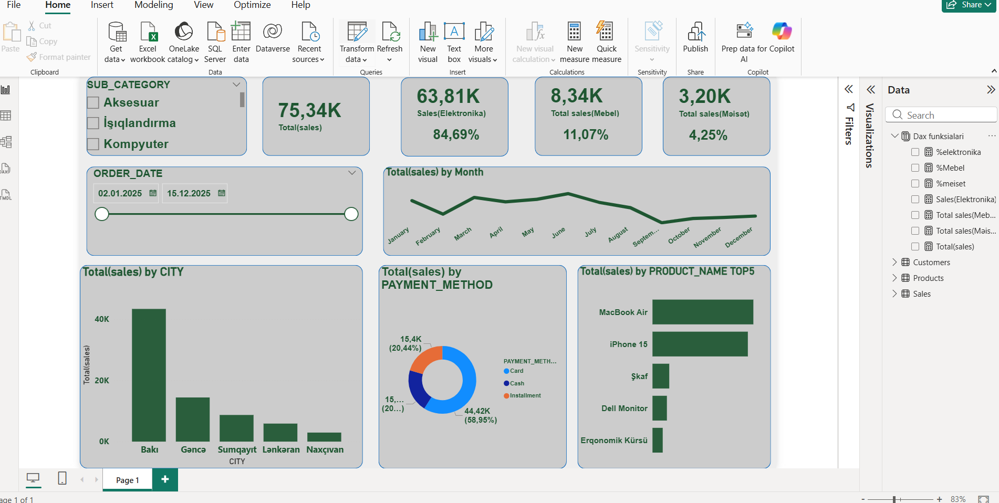

# 📊 Oracle SQL & PL/SQL: Sales Analytics Project

Bu layihə bir satış sisteminin verilənlər bazası modelini, biznes məntiqini və analitik hesabatlılığını əks etdirir. Layihə tam olaraq Oracle SQL mühitində hazırlanmışdır.

## 🛠️ Layihənin Strukturu
Layihə 4 əsas mərhələdən ibarətdir:
1. **[01_schema.sql.sql](./01_schema.sql.sql)**: Cədvəllərin (Customers, Products, Sales) yaradılması və DDL əməliyyatları.
2. **[02_logic.sql.sql](./02_logic.sql.sql)**: PL/SQL Package-lər (sp_add_prod, fn_cust_seg) və Data Integrity üçün Triggerlər.
3. **[03_data.sql.sql](./03_data.sql.sql)**: Analiz üçün yaradılmış 100+ sətirlik sintetik satış məlumatları.
4. **[04_analysis.sql.sql](./04_analysis.sql.sql)**: Top 5 məhsul, Şəhər üzrə gəlir və Müştəri seqmentasiyası analizləri.

## 💡 Əsas Texniki Həllər
* **Avtomatik Müştəri Seqmentasiyası**: Müştərilərin alış həcminə görə Gold, Silver və Bronze kateqoriyalarına bölünməsi üçün funksiya.
* **Məlumat Arxivlənməsi**: Silinən məhsulların avtomatik olaraq `Deleted_Products` cədvəlinə köçürülməsi (Trigger).
* **Biznes Qaydaları**: Məhsulun satış qiymətinin maya dəyərindən aşağı olmamasını yoxlayan PL/SQL proseduru.

---
*Bu layihə Data Analytics portfoliomun SQL hissəsini təmsil edir.*
## 📊 Power BI Dashboard
SQL-də hazırlanan məlumat bazası əsasında aşağıdakı interaktiv hesabat hazırlanmışdır:

### Hesabatın əhatə etdiyi göstəricilər:
* **Total Sales & Profit**: Ümumi satış həcmi və xalis mənfəət.
* **Top Products**: Ən çox gəlir gətirən məhsulların analizi.
* **City Performance**: Regionlar üzrə satış trendləri.
* **Customer Segments**: Müştəri loyallığı və seqmentasiya payı.
